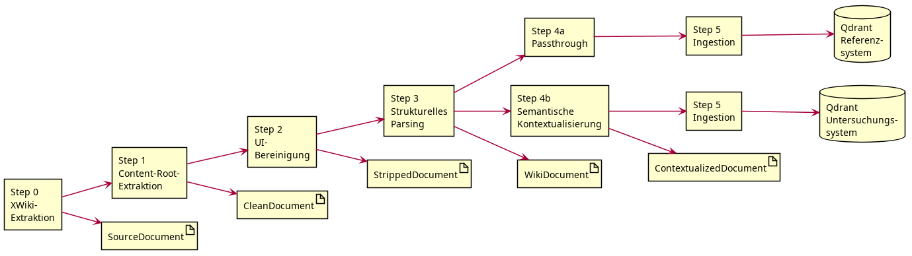
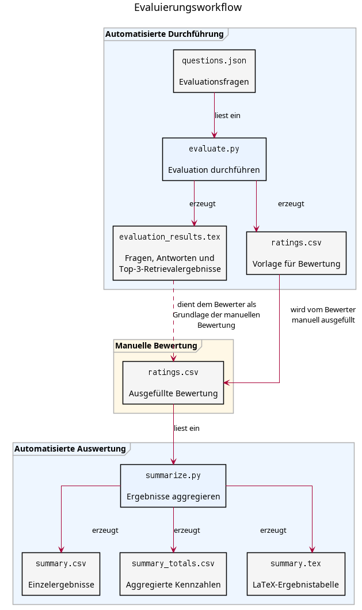

# struct2prose

**struct2prose** ist eine modulare Vorverarbeitungspipeline zur Transformation semi-strukturierter XWiki-Inhalte in eine für Retrieval-Augmented Generation (RAG) optimierte Wissensbasis.

Das Projekt entstand im Rahmen einer Masterarbeit und untersucht den Einfluss einer LLM-basierten semantischen Kontextualisierung strukturierter Wiki-Inhalte auf die Antwortqualität eines RAG-Systems.

---

# Pipeline

Die Verarbeitung erfolgt in sechs aufeinander aufbauenden Schritten.

| Schritt | Beschreibung |
|---------|--------------|
| **0** | Abruf der XWiki-Dokumente über die REST-Schnittstelle |
| **1** | Extraktion des eigentlichen Dokumentinhalts |
| **2** | Entfernung von UI- und Layout-Elementen |
| **3** | Parsing in semantische Dokumentblöcke (Absätze, Listen, Tabellen, Codeblöcke usw.) |
| **4** | Erzeugung der RAG-Repräsentation (LLM-Kontextualisierung oder Baseline) |
| **5** | Chunking, Embedding und Speicherung der Chunks in einer Qdrant-Vektordatenbank |


---

# Evaluation

Zur Evaluation werden zwei getrennte Wissensbasen erzeugt.

- **Untersuchungssystem:** Tabellen und Listen werden mittels eines Large Language Models semantisch kontextualisiert.
- **Referenzsystem:** Tabellen und Listen werden ohne semantische Transformation übernommen.

Beide Systeme verwenden identische

- Quelldokumente,
- Vorverarbeitungsschritte,
- Chunkingstrategie,
- Embedding-Modell,
- Retrieval-Konfiguration,
- Sprachmodell und
- Chat-Prompt.

Die semantische Kontextualisierung in Schritt 4 stellt somit die einzige unabhängige Variable der Evaluation dar.

Die beiden Wissensbasen werden in getrennten Qdrant-Collections gespeichert und anschließend mit identischen Evaluationsfragen verglichen.


---
## Projektstruktur

```text
struct2prose/
├── src/
│   └── struct2prose/
│       ├── cli.py
│       ├── config.py
│       │
│       ├── debug/
│       │   └── debug_contextualize.py
│       │
│       ├── models/
│       │   └── documents.py
│       │
│       ├── parser/
│       │   ├── html_parser.py
│       │   └── models.py
│       │
│       ├── persistence/
│       │   ├── db.py
│       │   └── store.py
│       │
│       ├── preprocessing/
│       │   ├── content_root.py
│       │   └── ui_strip.py
│       │
│       ├── scripts/
│       │   └── init_db.py
│       │
│       ├── services/
│       │   ├── llm_client.py
│       │   └── rag/
│       │       ├── api.py
│       │       ├── prompt.py
│       │       ├── retriever.py
│       │       └── schemas.py
│       │
│       └── steps/
│           ├── step0_fetch_xwiki.py
│           ├── step1_extract_root.py
│           ├── step2_strip_ui.py
│           ├── step3_parse.py
│           ├── step4_baseline.py
│           ├── step4_contextualize.py
│           ├── step5_ingest_qdrant.py
│           └── step5_ingest_qdrant_maxmin.py
│
├── evaluation/
│   ├── results/
│   └── auswertung/
│
├── state/
│   └── struct2prose.db
│
├── .env
├── .gitignore
├── LICENSE
├── pyproject.toml
├── README.md
└── venv/
```

---

# Installation

Repository klonen

```bash
git clone https://github.com/free-da/struct2prose.git
cd struct2prose
```

Virtuelle Umgebung erstellen

```bash
python -m venv .venv
source .venv/bin/activate
```

Abhängigkeiten installieren

```bash
pip install -e .
```

---

# Konfiguration

Die Anwendung wird über eine `.env`-Datei konfiguriert.

Beispiel:

```dotenv
# XWiki
XWIKI_BASE_URL=https://wiki.example.org
XWIKI_WIKI_ID=xwiki
XWIKI_USERNAME=admin
XWIKI_PASSWORD=password
RAW_DATA_DIR=raw_data

# LLM
LLM_PROVIDER=local
LOCAL_LLM_BASE_URL=http://localhost:8000
LOCAL_MODEL_NAME=Qwen/Qwen2.5-7B-Instruct

# alternativ: Groq
GROQ_API_KEY=
GROQ_MODEL_NAME=

# Embeddings
EMBEDDING_MODEL=sentence-transformers/all-MiniLM-L6-v2

# Qdrant
QDRANT_URL=http://localhost:6333
QDRANT_CONTEXTUALIZED_COLLECTION=contextualized
QDRANT_BASELINE_COLLECTION=baseline
```

---

# Verwendung

## Standardpipeline ausführen

```bash
python -m struct2prose all
```

Erzeugt die kontextualisierte Wissensbasis.

## Evaluationspipeline ausführen

```bash
python -m struct2prose all-eval
```

Erzeugt sowohl die kontextualisierte Wissensbasis als auch die Baseline-Wissensbasis für die Evaluation.

Für einzelne Verarbeitungsschritte stehen zusätzliche CLI-Befehle zur Verfügung. Diese dienen primär Entwicklungs- und Debuggingzwecken und werden nicht durchgängig gepflegt oder getestet.

## RAG-Service starten

Startet den REST-Service für das Retrieval-Augmented-Generation-System.
```bash
python -m struct2prose.services.rag.api
```
## Evaluation ausführen

Evaluationsfragen definieren in: `evaluation/questions.json`
Führt die definierten Evaluationsfragen gegen beide Wissensbasen aus und speichert die Ergebnisse im Verzeichnis evaluation/results/.

```bash
python evaluation/evaluate.py
```
Die Ergebnisse werden in einem Übersichtsdokument `evaluation/results/evaluation_results.tex` ausgegeben. Dies wird manuell überprüft und nach einem Punkteschema in `evaluation/auswertung/summary.csv` (Wird ebenfalls durch die Evaluation erzeugt) bewertet.

## Auswertung erzeugen

Erzeugt die aggregierten Auswertungen und Grafiken der Evaluation.

```bash
python evaluation/auswertung.py
```

Für einzelne Verarbeitungsschritte stehen zusätzliche CLI-Befehle zur Verfügung. Diese dienen primär Entwicklungs- und Debuggingzwecken und werden nicht durchgängig gepflegt oder getestet.

---

# Debugging

Für sämtliche Verarbeitungsschritte können Zwischenergebnisse als JSON-Artefakte erzeugt werden. Diese dienen der Nachvollziehbarkeit einzelner Transformationen sowie der Fehlersuche während der Entwicklung.

---

# Lizenz

Dieses Projekt wird unter der **GNU General Public License v3.0 (GPL-3.0)** veröffentlicht.

Weitere Informationen enthält die Datei `LICENSE`.

---

# Reproduzierbarkeit

Dieses Repository enthält die Implementierung der in der zugehörigen Masterarbeit beschriebenen Vorverarbeitungspipeline. Die Software wird unter der GNU General Public License v3.0 veröffentlicht und kann zur Reproduktion, Überprüfung und Weiterentwicklung der beschriebenen Verfahren verwendet werden.

Bei wissenschaftlicher Nutzung wird um eine Zitierung der zugehörigen Masterarbeit gebeten.